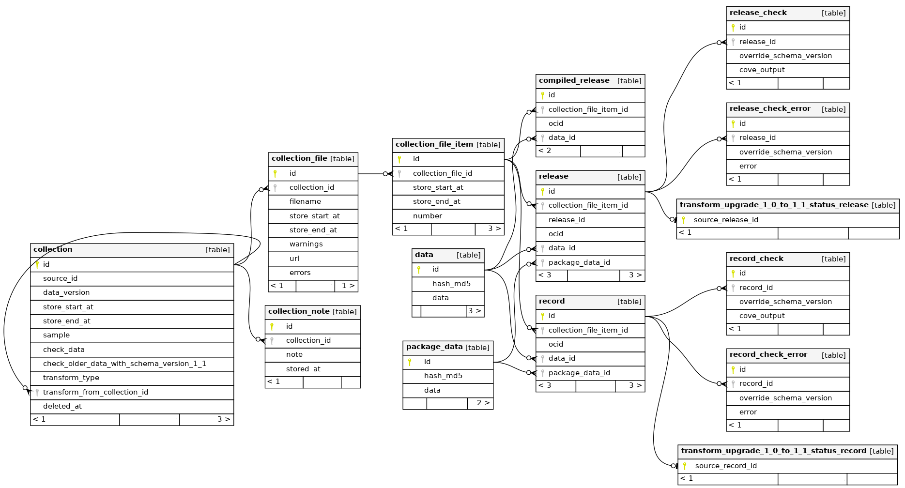

Database Structure
==================

Because Analysts query the data directly in the database, we document the structure here for them.

This is not a full description as you are expected to use normal tools to explore the database structure, but it hopefully contains the main points to get you started.

Reading :doc:`data-model` before reading this will probably help.

collection table
----------------

This has columns to store the variables that make up the unique definition of a collection:

*  `source_id`: the name of the collection that was run, for example 'canada_buyandsell'
*  `data_version`: the date and time when the run command was executed
*  `sample`: a mark that indicates if (false) the collection has all the available data or just a sample of it (true)
*  `transform_from_collection_id`
*  `transform_type`

This has columns to store what operations should be done to it:

*  `check_data`
*  `check_older_data_with_schema_version_1_1`

This has columns to track it's current state:

*  `store_start_at`: the date and time when the store stage begun
*  `store_end_at`: the data and time when the store stage end. For collections that are a transform, this means the time the transform finished.
*  `deleted_at`: the date and time when the collection was deleted. If this is set, this row will remain in the database but data about this collection may be cleared out of all other tables at any point and should NOT be relied on.

collection_note table
---------------------

This table stores each note in a collection.

collection_file table
---------------------

This table stores each file in a collection.

collection_file_item table
--------------------------

This table stores each item in a file.

data and package_data tables
----------------------------

These tables contain the actual data that is downloaded and stored.

The `hash_md5` column is used so that if duplicate data is noticed, we only store one copy of it.

This situation might arise when:

* storing one source - the package data is often the same
* storing one source at two different points in time - a lot of the data will be unchanged and the same

release, record and compiled_release tables
-------------------------------------------

Each row is linked to `collection_file_item` and thus to Collections. Each row is also linked to the `data` and `package_data` tables that actually hold the data.

release_check, record_check, release_check_error and record_check_error tables
------------------------------------------------------------------------------

These tables store the results of running the Data Review Tool (also called CoVE) on each piece of data. See http://standard.open-contracting.org/review/

transform_upgrade_1_0_to_1_1_status_release and transform_upgrade_1_0_to_1_1_status_record
------------------------------------------------------------------------------------------

These tables are simply used to store the progress of a Transform.

