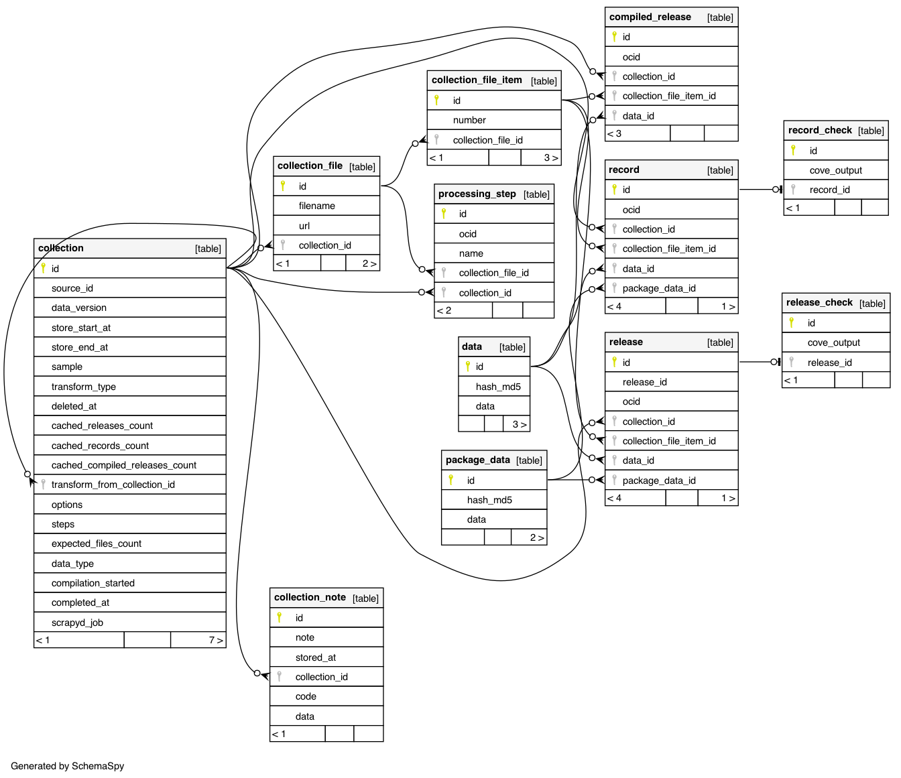

Database tables
===============

..
   To update the diagram, see https://ocp-software-handbook.readthedocs.io/en/latest/services/postgresql.html#generate-entity-relationship-diagram
   java -jar schemaspy.jar -t pgsql -dp postgresql.jar -o schemaspy -norows -I '(django|auth).*' -host localhost -db kingfisher_process -u MYUSER

.. list-table::
   :header-rows: 1

   * - Name
     - Description
   * - ``collection``
     - A collection, like the collection of files written to a crawl directory by Kingfisher Collect. See :ref:`db-collection`.
   * - ``collection_file``
     - A file containing a release package or record package, like the files written by Kingfisher Collect.
   * - ``collection_note``
     - A collection note. See :ref:`db-collection_note`.
   * - ``package_data``
     - The metadata for a release package or record package.

       The metadata is stored separately, to only store one copy of the same metadata within the same collection or across different collections.
   * - ``data``
     - The data for a release, record or compiled release.

       The data is stored separately, to only store one copy of the same data across different collections of the same publication.
   * - ``record``
     - A record, from a record package.
   * - ``release``
     - A release, from a release package.
   * - ``compiled_release``
     - A compiled release.
   * - ``record_check``
     - A record's check results.
   * - ``release_check``
     - A release's check results.
   * - ``processing_step``
     - Temporary rows to track incomplete operations (load, compile, check) on collection files.

The format of the ``cove_output`` column of the ``*_check`` tables is described in the `lib-cove-ocds documentation <https://github.com/open-contracting/lib-cove-ocds?tab=readme-ov-file#output-json-format>`__ (also used by the `OCDS Data Review Tool <https://review.standard.open-contracting.org>`__), without:

-  ``additional_checks``
-  ``records_aggregates``
-  ``releases_aggregates``

.. _db-collection:

collection table
----------------

.. list-table::
   :header-rows: 1

   * - Column
     - Description
   * - ``source_id``
     - The source from which the files were retrieved, like the spider name from Kingfisher Collect.
   * - ``data_version``
     - The time at which the files were retrieved, like the ``start_time`` statistic from Kingfisher Collect.
   * - ``sample``
     - Whether the files represent a sample from the source.
   * - ``transform_type``
     - One of "compile-releases" or "upgrade-1-0-to-1-1".
   * - ``transform_from_collection_id``
     - The parent collection from which this collection is derived.
   * - ``options``
     - A JSON object for the :ref:`process manager<integration-patterns>` pattern.
   * - ``steps``
     - A JSON array with one or more of "upgrade", "compile", "check".
   * - ``data_type``
     - A JSON object like ``{"format": "release package", "concatenated": false, "array": false}``.

       See OCDS Kit's `detect_format() <https://ocdskit.readthedocs.io/en/latest/api/util.html#ocdskit.util.detect_format>`__ function.
   * - ``scrapyd_job``
     - The ID of the job in Scrapyd.

       Use this column to find the crawl log.
   * - ``expected_files_count``
     - The number of non-error messages to expect from Kingfisher Collect.
   * - ``store_start_at``
     - The time at which the collection was added.
   * - ``store_end_at``
     - The time at which the collection was closed.
   * - ``compilation_started``
     - Whether compilation has started.
   * - ``completed_at``
     - The time at which processing completed.
   * - ``deleted_at``
     - The time at which the collection was cancelled.
   * - ``cached_releases_count``
     - The number of rows in the ``release`` table for this collection, once completed.
   * - ``cached_records_count``
     - The number of rows in the ``record`` table for this collection, once completed.
   * - ``cached_compiled_releases_count``
     - The number of rows in the ``compiled_release`` table for this collection, once completed.

.. _db-collection_note:

collection_note table
---------------------

All warnings and handled errors are logged as notes.

.. list-table::
   :header-rows: 1

   * - Column
     - Description
   * - ``collection_id``
     - The collection to which the note relates.
   * - ``note``
     - The note's message.
   * - ``data``
     - Any additional data, as JSON.
   * - ``stored_at``
     - The time at which the note was created.
   * - ``code``
     - One of "INFO", "WARNING" or "ERROR".

       Use this column to filter by severity.

For brevity, emoji are used in the tables for:

📑
  The original collection
⬆️
  The upgraded collection
🗜
  The compiled collection

INFO-level notes
~~~~~~~~~~~~~~~~

.. list-table::
   :header-rows: 1

   * - ``note``
     - On
     - Occurs when
     - Interpretation
   * - A user-provided note
     - 📑
     - A user creates a collection via Kingfisher Collect or the :ref:`cli-load` command.
     - Determine who created the collection.
   * - ``Spider close reason: {reason}``
     - 📑
     - Kingfisher Collect closes the spider.
     - `Check the reason for closing the spider <https://kingfisher-collect.readthedocs.io/en/latest/logs.html#check-the-reason-for-closing-the-spider>`__.
   * - ``Spider stats``
     - 📑
     - Kingfisher Collect closes the spider.
     - `Check the crawl statistics <https://kingfisher-collect.readthedocs.io/en/latest/logs.html#check-the-crawl-statistics>`__ (in the ``data`` column).

WARNING-level notes
~~~~~~~~~~~~~~~~~~~

.. list-table::
   :header-rows: 1

   * - ``note``
     - On
     - Occurs when
     - Interpretation
   * - ``Empty format 'empty-package' for file {collection_file}.``
     - 📑
     - :ref:`cli-file_worker` skips a file that contains package metadata only.
     - The data source contains empty packages.
   * - | ``party in "{party A's role}" role differs from party in [{party B's roles}] roles:``
       | ``{party A as JSON}``
       | ``{party B as JSON}``
     - ⬆️
     - :ref:`cli-file_worker` upgrades the file from OCDS 1.0.
     - Potential data loss.

       See OCDS Kit's `upgrade <https://ocdskit.readthedocs.io/en/latest/cli/ocds.html#upgrade>`__ command.
   * - Various
     - 🗜
     - :ref:`cli-release_compiler` or :ref:`cli-record_compiler` extends the release schema.
     - An OCDS extension is not retrievable or is invalid UTF-8, JSON or ZIP.

       Any merge rules from the extension aren't applied.
   * - ``Multiple objects have the `id` value ({key}) in the `{path}` array``
     - 🗜
     - :ref:`cli-release_compiler` or :ref:`cli-record_compiler` creates a compiled release.
     - An array contains objects with the same ID.

       Potential data loss, if the duplicates differ.
   * - ``OCID {ocid} has ## duplicates.``
     - 🗜
     - :ref:`cli-record_compiler` finds many records with the same OCID.
     - Only one record is compiled for each OCID.

       Potential data loss, if the duplicates differ.
   * - ``OCID {ocid} has ## undated releases. The ## dated releases have been compiled.``
     - 🗜
     - :ref:`cli-record_compiler` finds releases without a ``date`` field in a record.
     - Only dated releases are compiled.

       Potential data loss, if the undated releases differ.

ERROR-level notes
~~~~~~~~~~~~~~~~~

.. list-table::
   :header-rows: 1

   * - ``note``
     - On
     - Occurs when
     - Interpretation
     - ``data``
   * - ``Couldn't download {url}``
     - 📑
     - Kingfisher Collect fails to retrieve a URL. (:ref:`cli-api_loader`) `#366 <https://github.com/open-contracting/kingfisher-process/issues/366>`__
     - `Check for FileError items <https://kingfisher-collect.readthedocs.io/en/latest/logs.html#check-for-fileerror-items>`__.
     - FileError item
   * - ``{filename} has disappeared, skipping``
     - 📑
     - :ref:`cli-file_worker` fails to load the file to the database.
     - A user deleted the file before it was loaded.
     - RabbitMQ message
   * - ``Source {source_id} yields an unknown or unsupported format, skipping``
     - 📑
     - :ref:`cli-file_worker` fails to load the file to the database.
     - The data source doesn't conform to OCDS, or the spider has a bug to fix.
     - RabbitMQ message
   * - ``Source {source_id} yields invalid JSON, skipping``
     - 📑
     - :ref:`cli-file_worker` fails to load the file to the database.
     - Set a ``validate_json = True`` class attribute on the spider.
     - RabbitMQ message
   * - ``OCID {ocid} can't be compiled``
     - 🗜
     - :ref:`cli-release_compiler` or :ref:`cli-record_compiler` fails to create a compiled release.
     - The data source doesn't conform to OCDS.
     -

Other compilation notes
~~~~~~~~~~~~~~~~~~~~~~~

These notes on the 🗜 compiled collection are written by :ref:`cli-record_compiler` and prefixed by one of:

-  ``OCID {ocid} has ## linked releases among ## dated releases and ## releases.``
-  ``OCID {ocid} has ## releases, all undated.``
-  ``OCID {ocid} has 0 releases.``

In other words, the record contains either some linked releases, only undated releases or no releases.

In these cases, it's possible that the data source's merge routine isn't correct: that is, the compiled release doesn't represent individual releases.

.. list-table::
   :header-rows: 1

   * - code
     - note
     - Occurs when
     - Interpretation
   * - ``INFO``
     - ``Its compiledRelease was used.``
     - Compiling records
     - The record's releases are all linked, which is fine.

       A publisher-generated compiled release is used.
   * - ``WARNING``
     - ``Its compiledRelease was used.``
     - Compiling records
     - A publisher-generated compiled release is used.
   * - ``WARNING``
     - ``Its [first|only] release tagged 'compiled' was used.``
     - Compiling records
     - A publisher-generated compiled release is used.
   * - ``ERROR``
     - ``It has no compiledRelease and no releases tagged 'compiled'. It was not compiled.``
     - Compiling records
     - The record is absent from the compiled collection.

